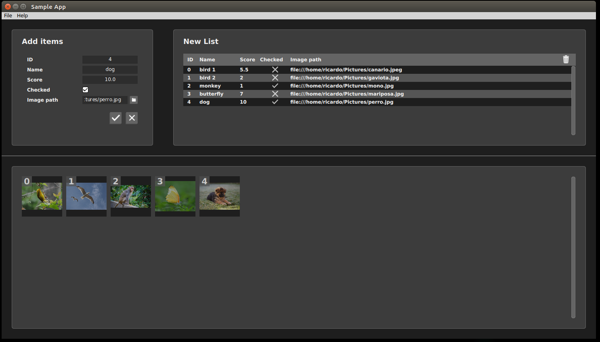

# Qt-QML Sample App

Simple Qt Application project with front-end developed using QML. The aim of this app is to be used as example or template project to develop other Qt apps.

    

If you want to just use it, you can go directly to the [Releases](https://github.com/robotics-upo/haru-routines-creator/releases/latest) page of this repository and download the last AppImage Linux executable. Developers must install all the dependecies and follow the installation steps.

## Dependencies

* Multi-platform: Linux and Windows

* [Qt + QtCreator](https://www.qt.io/download). Created using Qt 5.14.2

Any other library different to the provided by Qt has been used to simplify the example.

## Installation

Just open the project file [sample_app.pro](haru_routines_creator.pro) using **QtCreator**, configure the project using the default settings and compile.

## Deploying the App for Linux

To create a self-contained executable easily, we recommend the [AppImage](https://github.com/probonopd/linuxdeployqt) tool. You can also get the current deployed AppImage of this app from **Releases** page of this repository. If you want to create one by yourself, follow the instructions described in the file [AppImage/HowTo.md](AppImage/HowTo.md).
